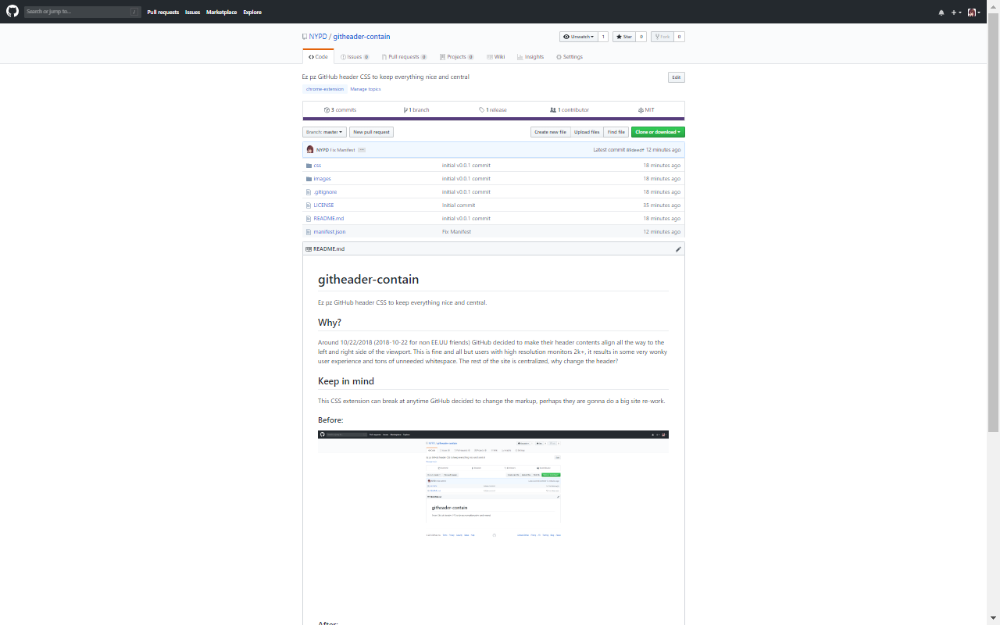
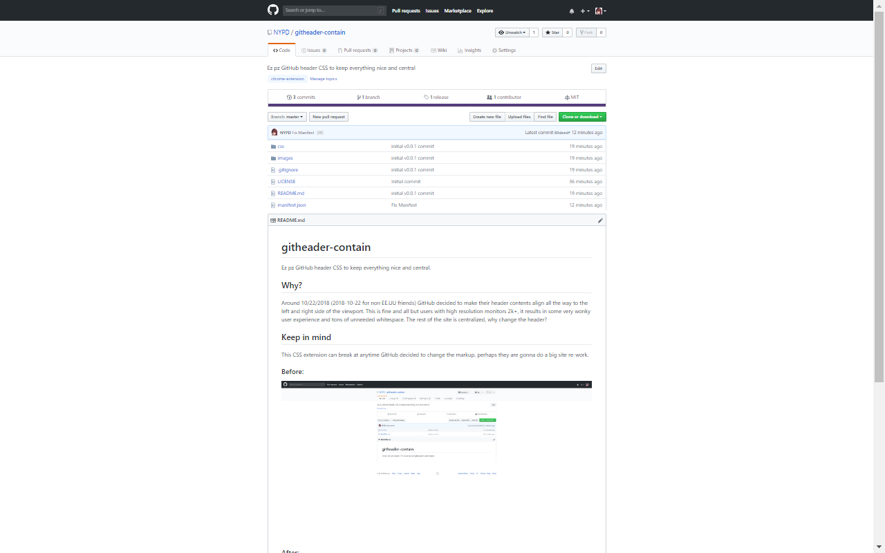

# githeader-contain

Ez pz GitHub header CSS to keep everything nice and central.

Check it out on the [chrome web store](https://chrome.google.com/webstore/detail/githeader-contain/pcpldafjkkcdckcdkekdacgfdbnidfpj?hl=en-US&gl=US)
or the [Firefox Add-ons page.](https://addons.mozilla.org/en-US/firefox/addon/githeader-contain/)

## Why?

Around 10/22/2018 (2018-10-22 for non EE.UU friends) GitHub decided to make their header contents align all the way to the left and right side of the viewport. This is fine and all but users with high resolution monitors 2k+, it results in some very wonky user experience and tons of unneeded whitespace. The rest of the site is centralized, why change the header?

## Keep in mind

This CSS extension can break at anytime GitHub decides to change their website markup. Perhaps they are gonna make a full page app for their entire site.

### Before

### After

## Update 2018-1-17

Github now has switched their dashboard layout to full-width so this extension will not work on the dashboard anymore
